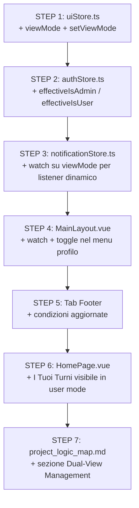

# Piano d'Azione: Dual-View Management per Admin
**Progetto:** NurseHub | **Fase:** 34 - Duality of Service
**Regole:** `project-rules.md` | **Logica:** `project_logic_map.md`

---

> [!IMPORTANT]
> Il `viewMode` è una preferenza **locale** (localStorage). Non altera il JWT né i Custom Claims.
> I Claims JWT rimangono invariati (Admin è sempre Admin sul backend).
> Il frontend applica un **fencing logico** basato su `viewMode` per silenziare o visualizzare le funzionalità.

---

## Analisi dell'Architettura Esistente

### Punti di Forza (da rispettare)
- `authStore.ts`: Già strutturato con `claimRole` da JWT come fonte primaria. **Non tocchiamo i claim.**
- `notificationStore.ts`: Già separato in `initAdminListener()` vs `initUserListener()`. **Pivot naturale.**
- `MainLayout.vue`: Il `if (authStore.isAnyAdmin)` su riga 74 decide quale listener attivare. **Punto di intervento principale.**
- `uiStore.ts`: Già gestisce la visibilità dei tab (`isTabVisible`). **Integreremo `viewMode` qui.**

### Problemi Attuali
1. **Home Page**: Un admin non vede "I Tuoi Turni" perché `isAnyAdmin` condiziona tutta la UI.
2. **Notifiche**: L'Admin riceve `initAdminListener` e non `initUserListener` — nessuna via di mezzo.
3. **Calendario Admin**: La pagina `/calendar` mostra tutti gli operatori ma non il proprio profilo personale in primo piano.
4. **Tab Footer**: In modalità admin, le tab `/requests` (user) è nascosta — l'admin non può vedere le sue candidature.

---

## Piano d'Azione Dettagliato

### STEP 1 — `uiStore.ts` — Aggiungere `viewMode`

**Motivazione:** `uiStore` è già il responsabile delle preferenze UI e persiste nel localStorage. È il posto naturale per `viewMode` per rispettare la regola **§1.8 — Single Source of Truth per UI State**.

```typescript
// In uiStore.ts

// Persistenza: chiave separata per device
const VIEW_MODE_KEY = 'nhub_view_mode';

const viewMode = ref<'admin' | 'user'>(
  (localStorage.getItem(VIEW_MODE_KEY) as 'admin' | 'user') ?? 'admin'
);

function setViewMode(mode: 'admin' | 'user'): void {
  viewMode.value = mode;
  localStorage.setItem(VIEW_MODE_KEY, mode);
}

// Computed helper (da usare in tutta l'app)
// IMPORTANTE: ritorna 'admin' solo se l'utente HA i claim E la modalità è admin
// Se l'utente NON è admin, questa computed ritorna SEMPRE 'user'
```

**Gatekeeper:** Il setter `setViewMode` verrà chiamato SOLO da componenti che verificano prima `authStore.isAnyAdmin`. Se un utente normale prova a modificarlo manualmente nel localStorage, il sistema lo ignora tramite computed.

---

### STEP 2 — `authStore.ts` — Computed Effettiva

**Motivazione:** Aggiungere un computed derivato che rappresenta il "ruolo effettivo" visto dall'app, combinando JWT + viewMode. **Nessuna modifica al JWT.**

```typescript
// In authStore.ts (import uiStore)

/** 
 * Ruolo effettivo: considera viewMode per admin che scelgono la vista utente.
 * JWT claim NON viene alterato — solo la vista frontend cambia.
 * Regola §1.10: JWT è sempre la fonte di verità per i permessi reali.
 */
const effectiveIsAdmin = computed(() => {
  const uiStore = useUiStore();
  if (!isAnyAdmin.value) return false;
  return uiStore.viewMode === 'admin';
});

const effectiveIsUser = computed(() => !effectiveIsAdmin.value);
```

---

### STEP 3 — `notificationStore.ts` — Listener Dinamico

**Motivazione:** Questa è la logica più critica. Il listener deve cambiare **reattivamente** quando `viewMode` cambia.

**Approccio:** Aggiungere una funzione `initDualListener` che viene chiamata da `MainLayout.vue` e reagisce al cambio di `viewMode`.

```typescript
// In notificationStore.ts

function initDualListener(
  userId: string,
  isAdminMode: boolean,
  onAdminNotification: () => void,
  onUserUpdate: (req: ShiftRequest) => void
): void {
  stopListeners(); // Sempre ferma il listener precedente
  
  if (isAdminMode) {
    initAdminListener(onAdminNotification);
  } else {
    // In modalità user: l'admin vede le sue candidature come utente normale
    initUserListener(userId, onUserUpdate);
  }
}
```

---

### STEP 4 — `MainLayout.vue` — Punto di Orchestrazione

**Motivazione:** Il punto di attivazione dei listener è qui. Basta un `watch` su `viewMode` per ricollegarsi al listener corretto.

**Modifiche:**
1. Importare `uiStore` e usare `viewMode`.
2. Il blocco `if (authStore.isAnyAdmin)` su riga 74 diventa `if (authStore.effectiveIsAdmin)`.
3. Aggiungere un `watch(uiStore.viewMode)` che ferma e riattiva i listener al cambio.
4. Mostrare il **Toggle Admin/User** nel dropdown del profilo.

```typescript
// In MainLayout.vue

watch(() => uiStore.viewMode, (newMode) => {
  notificationStore.stopListeners();
  
  if (newMode === 'admin' && authStore.isAnyAdmin) {
    notificationStore.initAdminListener(() => { /* admin toast */ });
  } else if (authStore.currentUser?.uid) {
    notificationStore.initUserListener(authStore.currentUser.uid, (req) => { /* user toast */ });
  }
});
```

---

### STEP 5 — Tab Footer Dinamici

**Motivazione:** In modalità user, l'admin deve vedere le stesse tab di un utente normale (inclusa `/requests`).

**Logica nei tab:**
```html
<!-- Prima: v-if="!authStore.isAnyAdmin" -->
<!-- Dopo: -->
<q-route-tab 
  v-if="!authStore.isAnyAdmin || authStore.effectiveIsUser" 
  to="/requests" 
  icon="event_note" 
  label="Richieste" 
/>

<!-- Tab admin: visibili SOLO in modalità admin -->
<q-route-tab 
  v-if="authStore.effectiveIsAdmin && uiStore.isTabVisible('admin_requests')" 
  to="/admin/requests" ...
/>
```

---

### STEP 6 — Home Page (`HomePage.vue` o equivalente)

**Motivazione:** In modalità user, la Home deve mostrare "I Tuoi Turni" dell'admin come operatore.

```html
<!-- Sezione "I Tuoi Turni": visibile sempre se modalità user O se non admin -->
<OperatorCalendar 
  v-if="!authStore.isAnyAdmin || authStore.effectiveIsUser"
  :operator="authStore.currentOperator"
/>
```

---

### STEP 7 — Toggle UI nel Menu Profilo

**Motivazione:** Il Toggle è l'unico punto di accesso alla funzione. Visibile solo se `isAnyAdmin`.

```html
<!-- In MainLayout.vue, nel dropdown account -->
<template v-if="authStore.isAnyAdmin">
  <q-separator />
  <q-item>
    <q-item-section avatar>
      <q-icon :name="uiStore.viewMode === 'admin' ? 'admin_panel_settings' : 'person'" 
              :color="uiStore.viewMode === 'admin' ? 'primary' : 'grey'" />
    </q-item-section>
    <q-item-section>
      <q-item-label>Vista Corrente</q-item-label>
      <q-item-label caption>
        {{ uiStore.viewMode === 'admin' ? 'Modalità Admin' : 'Modalità Operatore' }}
      </q-item-label>
    </q-item-section>
    <q-item-section side>
      <q-toggle 
        :model-value="uiStore.viewMode === 'admin'"
        @update:model-value="uiStore.setViewMode($event ? 'admin' : 'user')"
        color="primary"
      />
    </q-item-section>
  </q-item>
</template>
```

---

## Sicurezza: Cosa NON cambia (Regola §1.10)

| Aspetto | Comportamento |
|---|---|
| **JWT Claims** | ✅ Invariati. L'admin resta admin sul backend. |
| **Firestore Rules** | ✅ Invariate. Le regole dipendono dal JWT, non dal `viewMode`. |
| **Route Guards** | ✅ Invariati. `/admin/requests` resta accessibile — solo non è più visibile dal footer. |
| **API Vercel** | ✅ Invariate. Le chiamate sono sempre autenticate con Bearer token JWT. |

> [!CAUTION]
> Il `viewMode` NON deve mai essere usato per by-passare le Firestore Rules.
> È esclusivamente un filtro di presentazione frontend.

---

## Ordine di Implementazione



---

## Aggiornamento `project_logic_map.md`

Da aggiungere in coda:

### 9. Dual-View Management (Phase 34)
Gli utenti con ruolo **Admin** o **SuperAdmin** possono attivare una **Modalità Operatore** 
per visualizzare l'app come un dipendente normale, mantenendo intatti i loro permessi reali (JWT).

- **`viewMode`**: Preferenza locale (`localStorage`), separata per device.
- **Notifiche Dinamiche**: I listener Firestore si reconfigurano al cambio di modalità.
- **Sicurezza**: Il JWT non è mai alterato. `viewMode` è esclusivamente un filtro di presentazione.
- **UX**: Toggle nel menu profilo con feedback visivo (icona + colore + caption).
